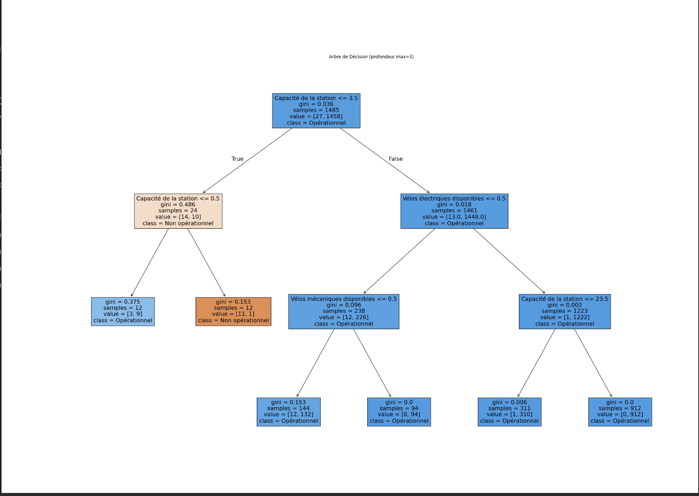
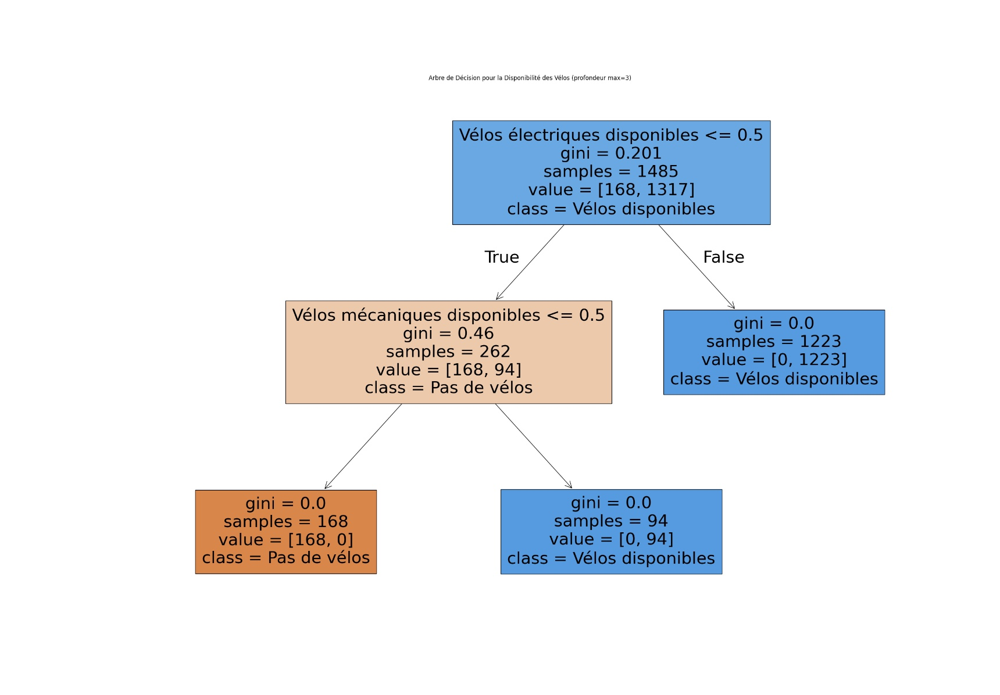
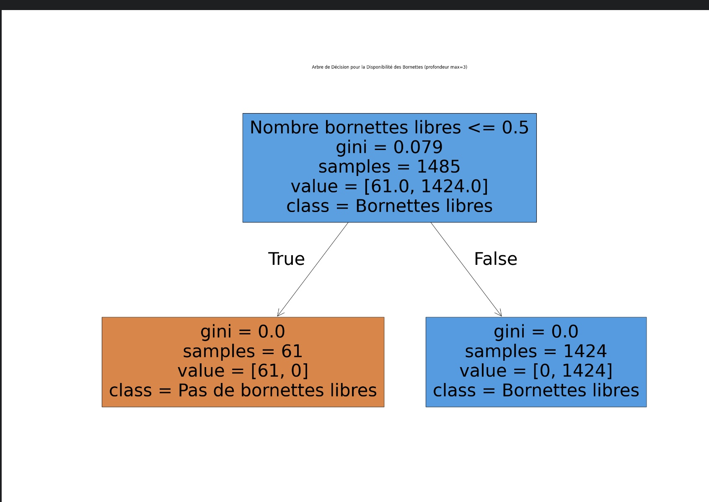

# TP - Analyse de la Disponibilité des Stations Vélib' avec des Arbres de Décision

## Description
Ce TP consiste à analyser la disponibilité des stations Vélib' à Paris en utilisant des arbres de décision. 
 J'ai construit trois modèles pour prédire différents aspects de la disponibilité des stations :

- **Disponibilité des stations** : Prédire si une station est en fonctionnement ou non.

La racine de l'arbre a un critère : Nombre bornettes libres <= 0.5.
Si cette condition est vraie (à gauche), il y a 0 bornettes libres (indiquant que la station est pleine).
Gini = 0, ce qui signifie une pureté totale dans les échantillons (61 cas où il n’y a pas de bornettes libres).
Si cette condition est fausse (à droite), il y a des bornettes libres.
Gini = 0, avec 1424 échantillons indiquant des bornettes disponibles.

- **Disponibilité des vélos** : Prédire si des vélos (mécaniques ou électriques) sont disponibles.

La racine de l'arbre utilise le critère Vélos électriques disponibles <= 0.5.
Si vrai (à gauche), il se dirige vers un autre critère : Vélos mécaniques disponibles <= 0.5.
Si cette condition est vraie, alors il n'y a pas de vélos disponibles (168 cas).
Si faux, cela signifie qu'il y a des vélos disponibles (94 cas).
Si faux (à droite), cela indique que des vélos sont disponibles (1223 cas).

- **Disponibilité des bornettes de stationnement** : Prédire si des bornettes de stationnement sont libres.

La racine de l'arbre a pour critère Capacité de la station <= 3.5.
Si vrai (à gauche), il teste un autre critère sur la Capacité de la station <= 0.5.
Ce sous-arbre montre différents niveaux de classification sur la base de la capacité, avec un cas où la station n'est pas opérationnelle (par exemple, Gini = 0.375 avec 12 échantillons).
Si faux (à droite), il évalue Vélos électriques disponibles <= 0.5 puis Vélos mécaniques disponibles <= 0.5 et un autre critère de capacité pour déterminer l’opérationnalité.
--**Conclusion** :
En conclusion, ces arbres de décision permettent d’analyser efficacement la disponibilité et l’opérationnalité des stations de vélos en tenant compte de critères essentiels comme la présence de bornettes libres, la disponibilité des vélos (électriques et mécaniques) et la capacité des stations. Chaque arbre répond à une question spécifique : l'accessibilité des bornettes, la disponibilité des vélos et l'état de fonctionnement de la station. Ensemble, ils offrent une vue d'ensemble utile pour optimiser la gestion des stations de vélos et améliorer l’expérience des usagers en assurant la disponibilité des ressources nécessaires.

## Etapes du TP
1. **Chargement des données** : J'ai utilisé un fichier CSV contenant les informations des stations Vélib' en temps réel (open data paris).
2. **Nettoyage des données** : Les valeurs manquantes ont été remplies et les variables catégorielles ont été converties en valeurs numériques.
3. **Création des modèles** : J'ai utilisé des arbres de décision pour prédire la disponibilité des stations, des vélos et des bornettes de stationnement.
4. **Visualisation des arbres** : Chaque modèle a été visualisé sous forme d'un arbre de décision pour observer les critères utilisés dans les prédictions.

## Fichiers du projet
- **velib-disponibilite-en-temps-reel.csv** : Le fichier contenant les données des stations Vélib'.
- **TP_velibdispo.py** : Le script Python exécutant l'analyse et l'entraînement des modèles.
- **README.md** : Ce fichier.
